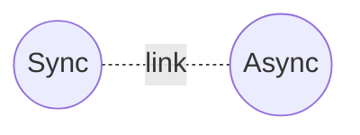

ospfclient
==========

This is an Erlang/OTP client for accessing the link-state database (LSDB) of
the OSPF daemon from [FRRouting](https://frrouting.org/) routing protocol suite.

Using this client, an Erlang application could:

* monitor the LSDB from OSPF daemon
* get informed from NSM, ISM, Router ID changes
* sync or resync LSDB, ISM, NSM

How to use
----------

You can register callbacks and get notified when something changed
in OSPF daemon.

```erlang
    Callbacks = #{
        'MSG_NSM_CHANGE' => fun my/3
        % 'MSG_LSA_UPDATE_NOTIFY' => fun my/3,
        % 'MSG_LSA_DELETE_NOTIFY' => fun my/3
    },
    Opts = [{callbacks, Callbacks}, {callback_data, self()}],

    {ok, Handle} = ospfclient:connect({192, 168, 56, 102}, Opts),
```

For now, the default OSPF client daemon is: 2607. And is not possible to define an alternative port.

All callbacks follow the type (`ospfclient:async_handler()`):

```erlang
    -type async_handler() :: fun((string(), term(), any()) -> ok).
```

The follow async messages are supported:

* 'MSG_READY_NOTIFY'
* 'MSG_LSA_UPDATE_NOTIFY'
* 'MSG_LSA_DELETE_NOTIFY'
* 'MSG_NEW_IF'
* 'MSG_DEL_IF'
* 'MSG_ISM_CHANGE'
* 'MSG_NSM_CHANGE'
* 'MSG_REACHABLE_CHANGE'
* 'MSG_ROUTER_ID_CHANGE'

Design
------

The module `ospfclient` spawns two erlang process responsible for handle sync and async messages.

* sync messages are to OSPF daemon
* async messages are messages from OSPF daemon

The sync and async process are linked for safe reasons. Each process manages a specific Socket.



There is a small connection protocol in order to get the async socket working:

* 4001/tcp port is open and waits for connection from OSPF daemon, this is the async socket
* next, a connection is made to OSPF daemon through dest 2607/tcp port and having the port 4000/tcp as source port
* the OSPF daemon receives the connection and also makes another connection to ospfclient which is listening connections to 4001/tcp port
* now both sockets are up and running.

The function `ospfclient:do_connect/2` is responsible for implementing that logic.

When calling: `ospfclient:connect/1` function, the caller receives back a Handle. That handle (which is a process id) should be used for further interactions with ospfclient.

If `callbacks` were registered when calling `ospfclient:connect/2` function, then the async process will call these callbacks for registered messages. In this context the caller will receive notifications for OSPF events like ISM, NSM, etc.

Build
-----

    $ rebar3 compile

Test Environment
----------------

There is no secret and all what we need is some FRR hosts in order to configure OSPF routes. My environment
was made using 3 virtual machines with Ubuntu 24 and FF installed from packages. Then I made OSPF configuration
and connect to one of virtual hosts. That is all.

Test
----

This project does not support unit test yet. It's a challenge to implement tests because it depends on
FRR ospf daemon.

    $ rebar3 as test shell
    Erlang/OTP 26 [erts-14.2.5] [source] [64-bit] [smp:32:12] [ds:32:12:10] [async-threads:1] [jit:ns]

    Eshell V14.2.5 (press Ctrl+G to abort, type help(). for help)
    
    1> H = ospfclient_test:test().

    2> ospfclinet:sync_nsm(H).
    
    callback mt "NSM_CHANGE" data <0.483.0> payload {msg_nsm_change,
                                                 {10,90,0,1},
                                                 {10,90,0,2},
                                                 {192,168,56,101},
                                                 4}
    callback mt "NSM_CHANGE" data <0.483.0> payload {msg_nsm_change,
                                                 {10,90,0,1},
                                                 {10,90,0,2},
                                                 {192,168,56,101},
                                                 6}
    callback mt "NSM_CHANGE" data <0.483.0> payload {msg_nsm_change,
                                                 {10,90,0,1},
                                                 {10,90,0,2},
                                                 {192,168,56,101},
                                                 7}
    callback mt "NSM_CHANGE" data <0.483.0> payload {msg_nsm_change,
                                                 {10,90,0,1},
                                                 {10,90,0,2},
                                                 {192,168,56,101},
                                                 9}


References
----------

* [OSPF API Documentation](https://docs.frrouting.org/projects/dev-guide/en/latest/ospf-api.html)
* [ospfclient in python](https://github.com/FRRouting/frr/blob/3d2c589766a7bd8694bcbdb8c6979178d1f2d811/ospfclient/ospfclient.py)
* [ospfclient in C](https://github.com/FRRouting/frr/blob/3d2c589766a7bd8694bcbdb8c6979178d1f2d811/ospfclient/ospfclient.c)
* [OSPF-API client in C](https://github.com/FRRouting/frr/blob/3d2c589766a7bd8694bcbdb8c6979178d1f2d811/ospfclient/ospf_apiclient.c)